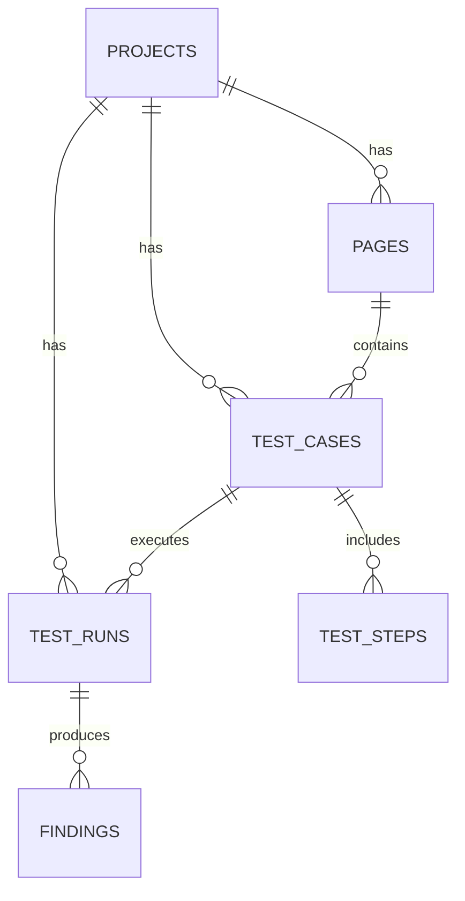

# VisionQA ERD (Database Schema)

Bu dokuman, `backend/database/models.py` icindeki mevcut SQLAlchemy modellerinin tablo iliskilerini ozetler.

## Varliklar

### `projects`
- `id` (PK)
- `name`
- `description`
- `platforms` (JSON)
- `created_at`
- `updated_at`

### `pages`
- `id` (PK)
- `project_id` (FK -> `projects.id`)
- `name`
- `url`
- `description`
- `created_at`

### `test_cases`
- `id` (PK)
- `project_id` (FK -> `projects.id`)
- `page_id` (FK -> `pages.id`, nullable)
- `title`
- `description`
- `category`
- `status`
- `priority`
- `platform`
- `created_at`
- `updated_at`

### `test_steps`
- `id` (PK)
- `test_case_id` (FK -> `test_cases.id`)
- `order`
- `action`
- `target`
- `value`
- `expected_result`
- `created_at`

### `test_runs`
- `id` (PK)
- `project_id` (FK -> `projects.id`)
- `page_id` (FK -> `pages.id`, nullable)
- `platform` (enum: `PlatformType`)
- `module_name`
- `target`
- `test_case_id` (FK -> `test_cases.id`, nullable)
- `status` (enum: `TestStatus`)
- `config` (JSON)
- `logs`
- `started_at`
- `completed_at`
- `created_at`

### `findings`
- `id` (PK)
- `test_run_id` (FK -> `test_runs.id`)
- `title`
- `description`
- `severity`
- `category`
- `screenshot_url`
- `extra_data` (JSON)
- `created_at`

## Iliskiler (Cardinality)

- `projects` 1 -> N `pages`
- `projects` 1 -> N `test_cases`
- `projects` 1 -> N `test_runs`
- `pages` 1 -> N `test_cases`
- `test_cases` 1 -> N `test_steps`
- `test_cases` 1 -> N `test_runs`
- `test_runs` 1 -> N `findings`

## Mermaid ER Diagram

